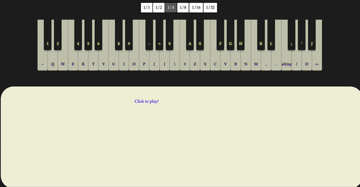

# Piano-Scribe
Interactive online piano player with live transcription and midi playback. 
Input is possible through midi input on Chrome, or computer keyboard and/or mouse on all browsers.

Play around with the latest version of it here https://ivan-v.github.io/Piano-Scribe/ ,
or see it as part of Virtual Bard: https://www.virtualbard.com/piano_scribe

## Libraries Used
- Keith Horwood's audiosynth for live playback:
https://keithwhor.github.io/audiosynth/

- Verovio JS Toolkit for rendering input notes: 
https://github.com/rism-ch/verovio

- MIDI Player for playback of transcribed notes: 
https://github.com/rism-ch/midi-player

## Inspiration
- Anna Neovesky & Gabriel Reimers' pianoKeyboard, which transcribes using Verovio: 
https://github.com/annaneo/pianoKeyboard
 
## Author

**Ivan Viro**
